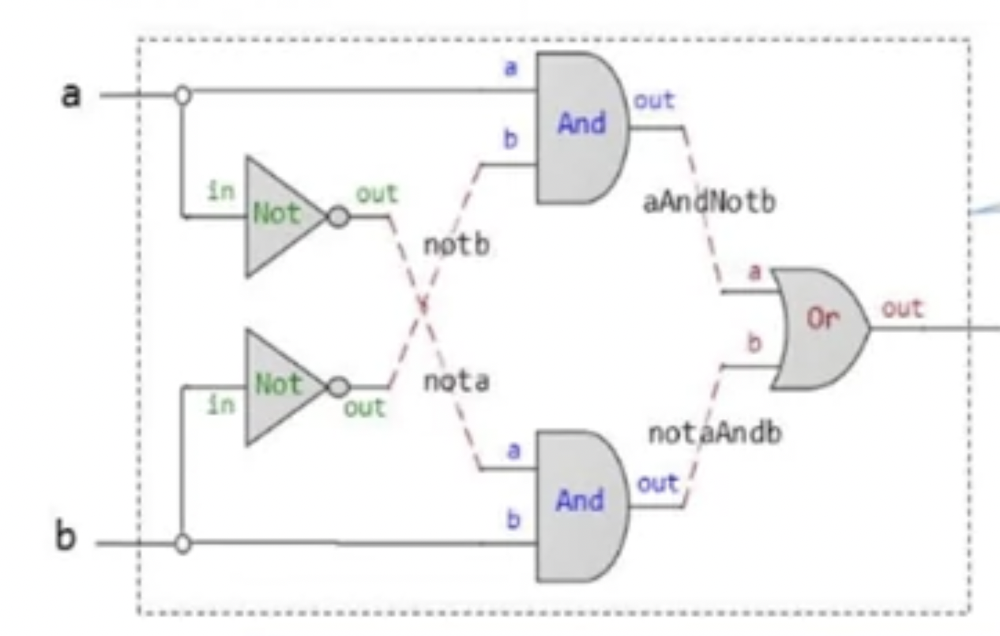

# Notes

## NAND and more

Statement: Any boolean function can be represented using an expression containing AND, OR and NOT operations

Proof:
(x OR y) = NOT(NOT(x) and NOT(y))

Statement: Any boolean function can be be represented using an expression containing only NAND operations

Proof:

1. NOT(x) = (x NAND x)
2. (x and y) = NOT(x NAND y)

> In digital electronics, a NAND gate is a logic gate which produces an output which is false only if all its inputs are true; thus its output is complement to that of an AND gate. A LOW output results only if all the inputs to the gate are HIGH; if any input is LOW, a HIGH output results.

## Gate Logic

> A technique for implementing boolean functions using logic gates

Logic gates are elementary (NAND, AND, OR, NOT, ...) and they are composite (Mux, Adder, ...)

### NAND Logic Gate

- Has two inputs and one output

```
if (a == 1 and b ==1) then out=0 else out = 1
```

## Circuit Implementations


- Lightbulb will be on if

# Hardware Description Language

---

- Gate interface is implemented as an HDL stub file
- HDl is a functional / declarative language ( gates can be described in any order)
- Left to right is preferred description

## Other Languages

- VHDL
- Verilog
- Many more, first two are used in 90% of hardware design projects

```hdl
CHIP Xor {
    IN a, b;
    OUT out;

    PARTS:
    // Not Implemented
}
```

> General idea: out = 1 when a AND NOT(b) OR b AND NOT(a) (a is true and b is false or b is true and a is false)

**Example:**


```hdl

CHIP Xor {
    IN a, b;
    OUT out;

    PARTS:
    Not (in = a, out = nota)
    Not (in = b, out = notb)
    And (a = a, b = notb, out = aAndNotb)
    And (a = nota, b = b, out = notaAndb)
    OR (a=aAndNotb, b = notaAndb, out = out)
}

```
